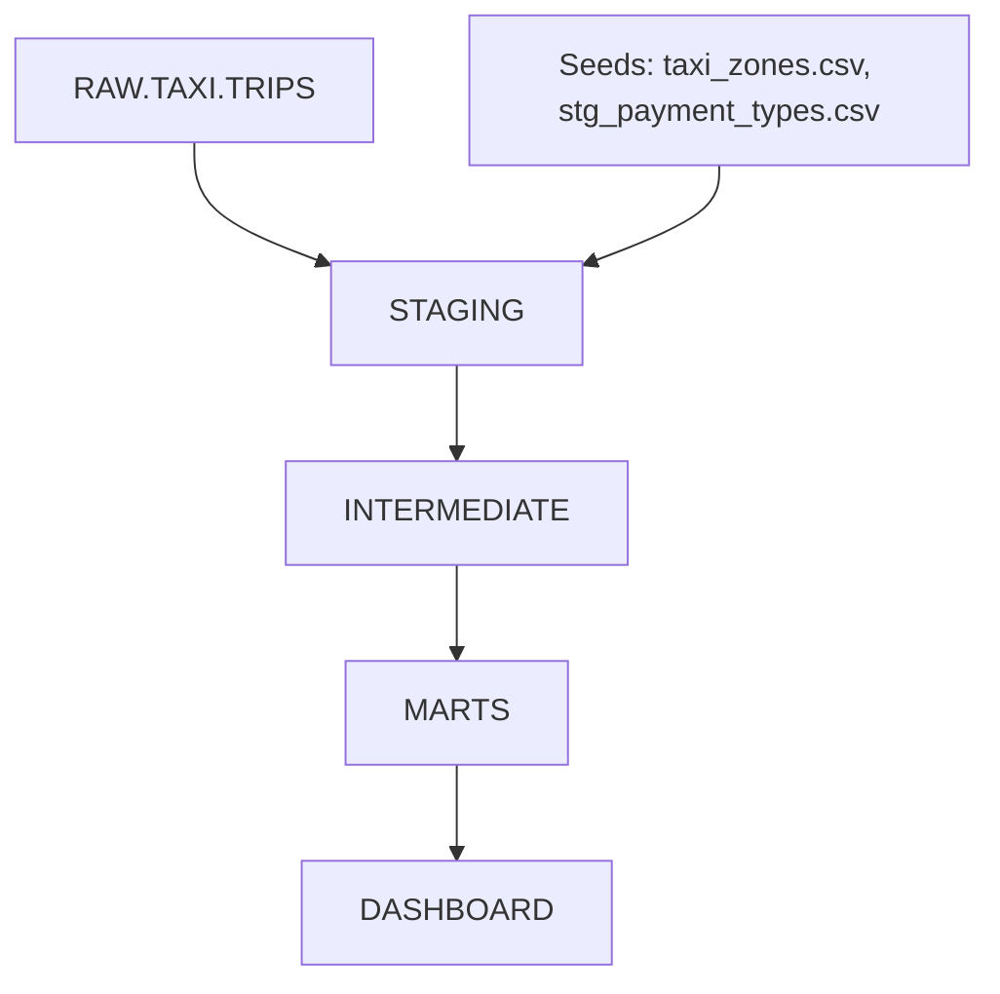
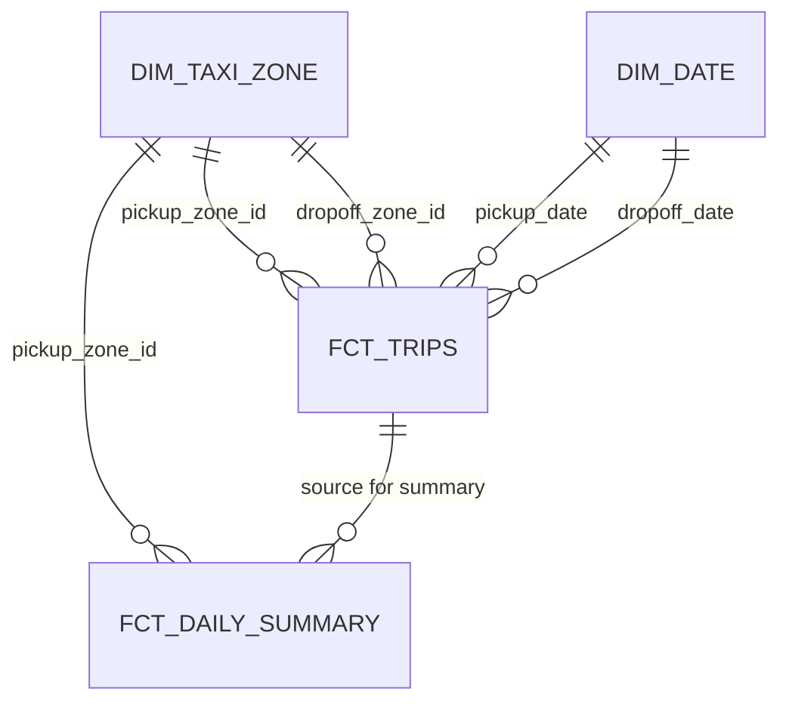
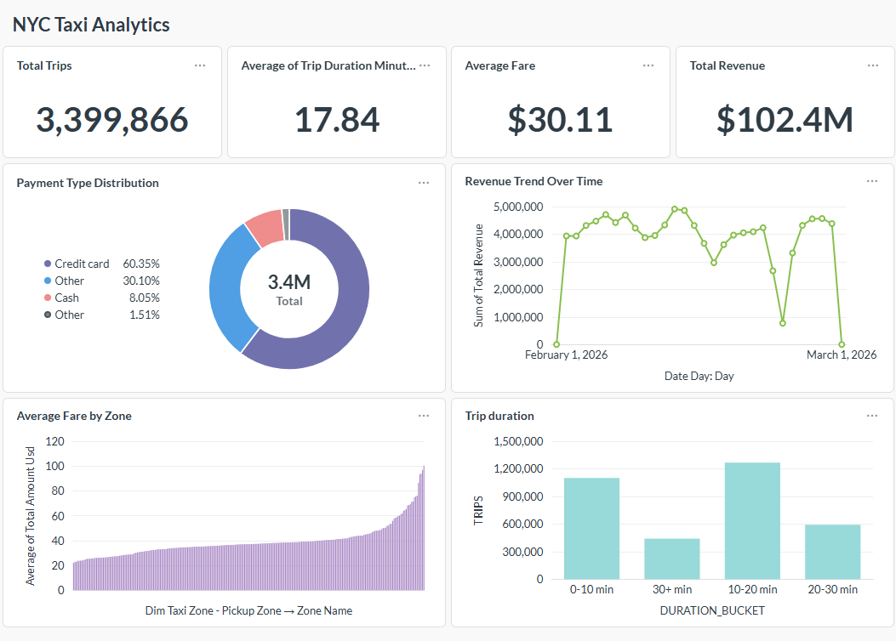

# NYC Taxi Revenue Analytics

[](https://github.com/laila-kz/end-to-end-analytics-engineering-pipeline/actions/workflows/dbt_ci.yml)
[](https://github.com/laila-kz/end-to-end-analytics-engineering-pipeline/actions/workflows/dbt_docs.yml)

This repository contains a production-style dbt analytics engineering project built on NYC Yellow Taxi trip data. It transforms raw Snowflake source records into clean staging models, enriched intermediate business metrics, and dimensional fact tables designed for revenue and trip performance analytics.

---

## Overview

This project solves the problem of converting raw taxi trip data into a trusted analytics layer for revenue reporting and operational insights. The core objective is to provide a clean, auditable pipeline from raw source tables to business-ready metrics for a revenue dashboard.

The final output supports questions such as:
- How much revenue is generated daily by pickup zone and payment type?
- Which pickup zones deliver the highest average fares and trip distances?
- How do trip durations, speed, and payment mix vary across NYC taxi trips?

The pipeline was built to demonstrate end-to-end analytics engineering, including source modeling, enrichment, dimensional modeling, testing, and CI/CD deployment.

---

## Architecture

The dbt workflow follows a layered medallion architecture:

RAW
↓
STAGING
↓
INTERMEDIATE
↓
MARTS
↓
DASHBOARD

### Layer purposes

- `RAW`: raw Snowflake source tables. In this project, the raw source is `RAW.TAXI.TRIPS` containing NYC Yellow Taxi trip JSON payloads.
- `STAGING`: lightweight standardization, type casting, and naming conventions. Staging models prepare raw columns for analytics consumption.
- `INTERMEDIATE`: enrichment and business metric calculation using lookup data and payment descriptions.
- `MARTS`: final dimensional and fact tables optimized for dashboard queries and analytics.
- `DASHBOARD`: BI consumption layer represented by dbt exposures and a Metabase dashboard definition.

### Architecture diagram



---

## Technologies Used

- **Snowflake**: used as the analytic warehouse and execution engine for SQL transformations. Snowflake provides the scalability and SQL compatibility needed to model large taxi trip datasets.
- **dbt Core**: the primary pipeline orchestration and transformation framework. dbt is used to manage model dependencies, version control SQL, maintain documentation, and enforce testing.
- **SQL**: the transformation language across all dbt models. Business logic, joins, aggregations, and metrics are expressed in Snowflake-compatible SQL.
- **Jinja**: dbt templating language used for model config, macro reuse, and deterministic surrogate key generation.
- **Git & GitHub**: source control for project versioning, collaboration, and change tracking.
- **GitHub Actions**: automated CI/CD workflows for validating dbt code, running modified models, testing, and publishing docs.
- **Metabase**: business intelligence tool implied by the dbt exposure metadata. It is used to host the revenue dashboard and link analytics models to dashboard assets.

---

## Project Structure

```text
.github/
  ├── workflows/
  │   ├── dbt_ci.yml
  │   └── dbt_docs.yml
docs/
  ├── dashboard/
  ├── diagrams/
  └── README.md
analyses/
macros/
  ├── fiscal_year.sql
  ├── generate_schema_name.sql
  └── generate_surrogate_key.sql
models/
  ├── intermediate/
  │   ├── int_trips_enriched.sql
  │   └── intermediate.yml
  ├── marts/
  │   └── core/
  │       ├── dim_date.sql
  │       ├── dim_taxi_zone.sql
  │       ├── fct_daily_summary.sql
  │       ├── fct_trips.sql
  │       └── marts.yml
  └── staging/
      └── taxi/
          ├── _taxi_sources.yml
          ├── stg_taxi_zones.sql
          ├── stg_taxi_zones.yml
          ├── stg_trips.sql
          └── stg_trips.yml
package-lock.yml
packages.yml
README.md
requirements.txt
seeds/
  ├── stg_payment_types.csv
  ├── stg_payment_types.yml
  ├── taxi_zones.csv
  └── taxi_zones.yml
snapshots/
tests/
```

### Folder purpose

- `.github/workflows/`: CI/CD definitions for dbt validation and documentation deployment.
- `docs/`: documentation and architecture artifacts for the project.
- `analyses/`: ad hoc analysis files and dbt exploration scripts.
- `macros/`: reusable SQL macros, including surrogate key generation and fiscal year logic.
- `models/`: dbt SQL models organized by staging, intermediate, and marts layers.
- `seeds/`: static lookup datasets for payment types and taxi zones.
- `tests/`: dbt tests and custom assertions.

---

## Data Model

This project includes the following key models:

### Fact tables

- `fct_trips`: one row per enriched taxi trip. Includes revenue, duration, speed, pickup/dropoff zone links, and denormalized dimension attributes.
- `fct_daily_summary`: daily aggregated performance by pickup zone and payment type, including total revenue, average fare, average distance, and trip count.

### Dimension tables

- `dim_taxi_zone`: taxi zone dimension with a deterministic surrogate key, zone name, borough, and service zone.
- `dim_date`: date dimension generated from the available taxi trip date range. Includes calendar year, quarter, month, week, weekday, weekend flag, and fiscal year.

### Grains

- `stg_trips`: one row per taxi trip.
- `int_trips_enriched`: one row per taxi trip with enriched metrics.
- `fct_trips`: one row per taxi trip in the analytics mart.
- `fct_daily_summary`: one row per day / pickup zone / payment type.

### Relationships

- `fct_trips.pickup_zone_id` → `dim_taxi_zone.zone_id`
- `fct_trips.dropoff_zone_id` → `dim_taxi_zone.zone_id`
- `fct_daily_summary.pickup_zone_id` → `dim_taxi_zone.zone_id`
- `fct_daily_summary.payment_code` joins back to the payment type lookup in staging

**Business logic**

- `stg_trips` standardizes raw trip JSON, converts timestamps, and applies strict data cleaning. A deterministic, hash-based `trip_key` is generated to ensure stable row identification across pipeline runs.
- `int_trips_enriched` adds:
  - pickup/dropoff day, month, year, and hour
  - trip duration and average speed
  - revenue before tip and revenue including tip
  - distance buckets for analysis
  - borough lookups for pickup and dropoff zones
  - human-readable payment descriptions
- `fct_trips` hardens revenue values to non-negative amounts and connects trips to numeric surrogate keys.
- `fct_daily_summary` aggregates daily revenue and average fare metrics for zone-level performance analysis.

### ERD diagram



---

## Data Quality & Testing

This project uses dbt schema tests and model tests to enforce data quality.

### Actual tests included

- `unique` and `not_null` tests on keys such as `trip_key`, `pickup_zone_id`, `dropoff_zone_id`, and surrogate keys.
- `accepted_values` tests for fields such as `trip_distance_bucket`, `store_and_forward_flag`, and `payment_code`.
- Seed tests for `stg_payment_types` and `taxi_zones` ensure lookup data is complete and unique.
- Custom validation through dbt model logic in fact tables ensures revenue is non-negative and trip records are valid.
- The intermediate model's tests are defined in `intermediate.yml`.
  
### How dbt ensures quality

- dbt schema tests are declared in YAML and executed automatically with `dbt test`.
- Staging models enforce consistent typing and null filtering before enrichment.
- Intermediate and mart models use deterministic surrogate keys and referential joins to preserve lineage.
- Incremental models use `delete+insert` to safely refresh recent partitions without rebuilding the full table.

### Examples from this project

- `stg_trips.yml` tests `trip_key` for uniqueness and `pickup_at`/`dropoff_at` for non-null values.
- `int_trips_enriched.yml` tests `trip_distance_bucket` accepted values and validates payment codes.
- `taxi_zones.yml` and `stg_payment_types.yml` both require `unique` and `not_null` for lookup IDs.

---

## CI/CD Pipeline

This repository includes two GitHub Actions workflows:

- `.github/workflows/dbt_ci.yml` — validation pipeline for pushes and pull requests.
- `.github/workflows/dbt_docs.yml` — documentation generation and GitHub Pages deployment.

### `dbt_ci.yml`

This workflow performs:
- checkout of repository code
- Python setup
- dependency installation from `requirements.txt`
- `dbt deps`
- `dbt run` (full build of all models)
- `dbt test` (full test suite)

This workflow ensures that every push to `main` and every pull request is validated by a complete build and full test suite. While this is a robust validation strategy, it can be optimized in the future with `state:modified+` for faster CI feedback.

### `dbt_docs.yml`

The docs workflow performs:
- checkout
- Python setup
- dependency installation
- `dbt deps`
- `dbt docs generate`
- upload `target` as artifact for GitHub Pages deployment

### Workflow diagram


---

## Documentation

This project uses dbt's built-in documentation generation.

To generate docs locally:

```bash
dbt docs generate
```

To serve docs locally:

```bash
dbt docs serve
```

If a deployed documentation site exists, add the URL here.

> Placeholder: Add GitHub Pages URL when docs are deployed.

---

## Dashboard

The project includes a dbt exposure for a Metabase revenue dashboard.

### Dashboard Overview



Caption: Summary view of daily revenue, trip counts, and payment mix for NYC taxi trips.


### KPIs and business metrics

- Total revenue including tips
- Average fare per trip
- Average trip distance
- Trip count by pickup zone and payment type
- Zone-level performance across boroughs
- Payment method composition and revenue share

---

## How to Run the Project

```bash
git clone https://github.com/laila-kz/end-to-end-analytics-engineering-pipeline.git

python -m venv .venv
.\.venv\Scripts\Activate.ps1
python -m pip install --upgrade pip
pip install -r requirements.txt
```

Configure `profiles.yml` for Snowflake under `~/.dbt/profiles.yml` using the profile name `first_project`.

Example profile settings:

```yaml
first_project:
  target: dev
  outputs:
    dev:
      type: snowflake
      account: <account>
      user: <user>
      password: <password>
      role: <role>
      database: RAW
      warehouse: <warehouse>
      schema: TAXI
      threads: 4
      client_session_keep_alive: False
```

Then run:

```bash
dbt deps
dbt build
```

To generate documentation:

```bash
dbt docs generate
dbt docs serve
```

---

## Key Learnings

- Designed a layered dbt pipeline that separates raw ingestion, staging, enrichment, and analytics marts.
- Built deterministic surrogate keys and dimension modeling for clean downstream joins.
- Used Snowflake SQL and Snowflake-compatible dbt patterns for scalable transformations.
- Implemented dbt schema testing and accepted-value checks to catch bad data early.
- Automated validation with GitHub Actions for modified model runs and documentation publication.

---

## Future Improvements

- Add a `dim_payment_type` dimension and use it in fact tables for richer payment analysis.
- Convert more models to incremental builds with partition-aware logic for production scale.
- Add snapshot testing or time-travel validation for source freshness and historical accuracy.
- Introduce metrics tests and monitoring for drift in revenue or trip volume.
- Expand dashboard coverage with regional and time-series revenue forecasting views.

---

## Recruiter Notes

- End-to-end analytics engineering workflow from raw Snowflake sources to BI-facing marts.
- Strong data modeling ability with staging, enrichment, and dimensional fact tables.
- dbt best practices including modular SQL, YAML documentation, and schema testing.
- Snowflake-specific implementation with timestamp conversion, date dimensions, and incremental models.
- CI/CD implemented through GitHub Actions for validation, modified model runs, and docs deployment.
- Dashboard exposure configured to connect analytics models to Metabase revenue reporting.

## Known Limitations

- **Incremental Fact Tables:** The `fct_trips` model uses an incremental filter based on `pickup_date` (`pickup_date >= max(pickup_date)`). This design assumes data arrives in near real-time or is loaded in batch without significant delays for past dates. It does not currently account for late-arriving records that have an older `pickup_date`. This is a known architectural trade-off made to prioritize processing speed and simplicity for the primary use case of daily reporting.
- **Source Freshness:** While source freshness checks are defined in the project, they are currently configured with `null` thresholds, making them effectively inactive. This is a planned enhancement for a future release.