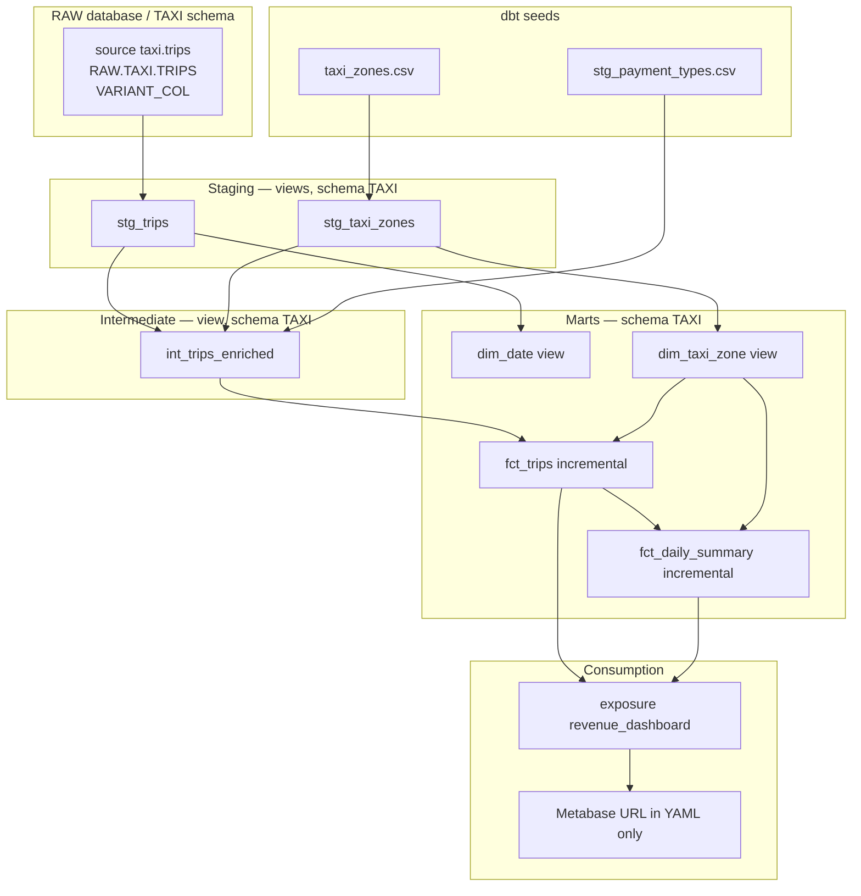
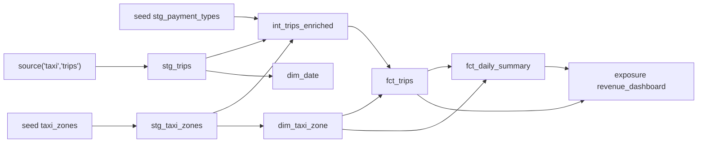
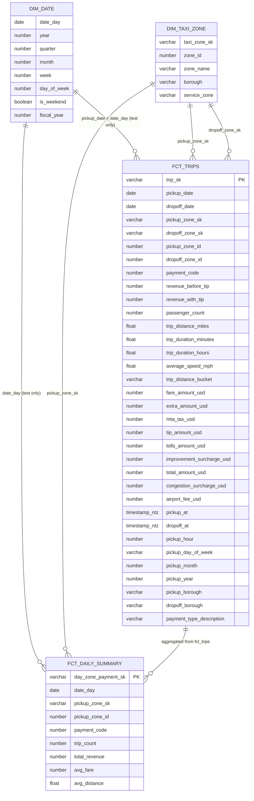

# NYC Taxi Revenue Analytics — Project Walkthrough

Onboarding document for the author of this dbt + Snowflake project. Every factual claim is grounded in a file in this repository. Where the repository is silent, the text says **NOT IN REPO** and then a labelled suggestion.

---

## 1. Elevator pitch

### 30 seconds (interview)

I built an end-to-end analytics engineering pipeline on NYC Yellow Taxi trips. Raw JSON lands in Snowflake as `RAW.TAXI.TRIPS`. dbt stages it, enriches it with zone and payment lookups, and publishes a small star schema: trip-level facts, a daily summary by zone and payment type, plus date and taxi-zone dimensions. The marts are tested, incremental where it matters, and wired to GitHub Actions so every push runs `dbt build` against Snowflake.

### 2 minutes (interview)

The business problem is turning messy TLC trip payloads into numbers a revenue dashboard can trust: daily revenue by pickup zone and payment type, average fare and distance, duration and speed, payment mix.

I used a layered dbt project named `first_project` (`dbt_project.yml`). Staging models are views: `stg_trips` extracts typed columns from a Snowflake `VARIANT` column, converts microsecond timestamps to `TIMESTAMP_NTZ`, and builds a hashed `trip_key`. `stg_taxi_zones` is a thin view over a seed. Payment types are a seed named `stg_payment_types`, joined in the intermediate layer rather than staged as SQL.

`int_trips_enriched` is the business-logic layer: borough lookups, payment descriptions, duration, average speed, distance buckets, and `revenue_before_tip = total_amount_usd - coalesce(tip_amount_usd, 0)`.

Marts: `dim_taxi_zone` and `dim_date` are views. `fct_trips` and `fct_daily_summary` are incremental tables using `delete+insert`. `fct_trips` keys off `trip_sk` (the staged `trip_key`) and reprocesses from `max(pickup_date)`. `fct_daily_summary` aggregates `fct_trips` by day, pickup zone, and payment code, with a 30-day lookback.

Quality is YAML tests plus `dbt_utils.expression_is_true` for non-negative revenue, and `relationships` tests from facts into `dim_date` and `dim_taxi_zone`. CI is a full `dbt build`, not `state:modified+`. A second workflow generates docs and deploys the `target/` folder to GitHub Pages. The dashboard itself is an exposure pointing at a placeholder Metabase URL; there is no dashboard JSON in the repo.

---

## 2. Business problem

**What questions it answers** (README.md, exposure description in `models/marts/exposures.yml`):

- How much revenue is generated daily by pickup zone and payment type? (`fct_daily_summary`: `total_revenue`, `trip_count`, `avg_fare`, `avg_distance` grouped by `date_day`, `pickup_zone_id`, `payment_code`.)
- Which pickup zones deliver the highest average fares and trip distances? (same daily grain, join `pickup_zone_sk` to `dim_taxi_zone`.)
- How do trip durations, speed, and payment mix vary across trips? (`fct_trips` / `int_trips_enriched`: `trip_duration_minutes`, `average_speed_mph`, `payment_type_description`, `trip_distance_bucket`.)

**Who would use it**

- **Analytics / revenue reporting** — the exposure is labelled “Revenue Dashboard” and owned by “Analytics Team” (`models/marts/exposures.yml`).
- **Operations / network analysts** — zone-level trip counts, distance, duration, speed.
- **Interview / portfolio reviewers** — the README states the pipeline was built to demonstrate source modeling, enrichment, dimensional modeling, testing, and CI/CD.

There is no stakeholder interview notes, SLA, or product spec **NOT IN REPO**. Suggested: treat TLC Yellow Taxi public data ([nyc.gov TLC trip records](https://www.nyc.gov/site/tlc/about/tlc-trip-record-data.page), cited in `models/staging/taxi/_taxi_sources.yml`) as a stand-in for a fleet or marketplace revenue mart.

---

## 3. Tech stack

| Tool | What it does here | Why this choice (vs alternatives) |
|---|---|---|
| **Snowflake** | Warehouse. Source `RAW.TAXI.TRIPS` with `VARIANT_COL`. Models run as Snowflake SQL (`to_timestamp_ntz`, `seq4()`, `generator`, `dayname`, `VARIANT` colon notation). Adapter `dbt-snowflake~=1.8.0` (`requirements.txt`). | vs BigQuery/Redshift/Postgres: the project is written in Snowflake dialect (`.sqlfluff` `dialect = snowflake`). VARIANT extraction is a Snowflake-native pattern. |
| **dbt Core ~1.8** | Transforms, refs, tests, docs, exposures (`requirements.txt`, `dbt_project.yml`). | vs stored procedures or Airflow SQL: versioned models, DAG from `ref()`/`source()`, YAML tests, docs generate. vs dbt Cloud: CI is GitHub Actions speaking to Snowflake with secrets (`.github/workflows/dbt_ci.yml`). |
| **SQL** | All model logic. | vs Python Spark: trip grain is relational; warehouse already holds the source. |
| **Jinja** | `config()`, `is_incremental()`, macros, `env_var('DBT_TARGET_DATABASE')`. | Required by dbt; used for surrogate keys and schema naming so keys stay deterministic. |
| **dbt_utils 1.4.1** | `dbt_utils.expression_is_true` on revenue/fare columns (`packages.yml`, `models/marts/core/core.yml`). | vs custom generic tests: package is pinned; surrogate keys are a *project* macro, not `dbt_utils.generate_surrogate_key`. |
| **Python 3.11 (CI)** | Installs dbt (`dbt_ci.yml`, `dbt_docs.yml`). | Matches GitHub `setup-python`. Local README does not pin Python. |
| **sqlfluff + sqlfluff-templater-dbt** | Lint Snowflake/Jinja SQL (`.sqlfluff`, `requirements.txt`). | vs none: dialect-aware linting. `profiles_dir = .` is a local gotcha (see §16). |
| **Git + GitHub** | Version control; remote implied by README clone URL and Actions badges. | Standard for dbt. |
| **GitHub Actions** | Full `dbt build` on every push/PR; docs generate + Pages deploy. | vs dbt Cloud CI: secrets-driven, no Slim CI artifacts in repo. |
| **Metabase (described, not shipped)** | Exposure `type: dashboard`, URL `https://metabase.example.com/dashboard/revenue` (`exposures.yml`). README KPIs. | vs Looker/Tableau: only metadata exists. No Metabase export **NOT IN REPO**. |
| **protobuf==4.25.3** | Pinned in `requirements.txt`. | Typical pin to avoid dbt/protobuf incompatibilities; no other mention in repo. |

Airflow, Fivetran, Snowpipe, and Terraform are **NOT IN REPO**. Suggested for a rebuild: load TLC Parquet into a stage and `COPY INTO` as described in comments in `_taxi_sources.yml`, then run dbt.

---

## 4. Architecture

### 4.1 Layered flow (as implemented)

Seeds are not only inputs to staging: `taxi_zones` feeds `stg_taxi_zones`; `stg_payment_types` is joined in `int_trips_enriched` (`models/intermediate/int_trips_enriched.sql`). Staging and intermediate are views (`dbt_project.yml`). Mart dimensions are views; facts are incremental tables (model `config()`).



### 4.2 Real model lineage DAG (`source()` and `ref()`)

Built only from SQL/YAML in this repo:



Call sites:

| Node | Upstream | File |
|---|---|---|
| `stg_trips` | `source('taxi','trips')` | `models/staging/taxi/stg_trips.sql` |
| `stg_taxi_zones` | `ref('taxi_zones')` | `models/staging/taxi/stg_taxi_zones.sql` |
| `int_trips_enriched` | `stg_trips`, `stg_taxi_zones` (twice: pickup + dropoff), `stg_payment_types` | `models/intermediate/int_trips_enriched.sql` |
| `dim_date` | `stg_trips` | `models/marts/core/dim_date.sql` |
| `dim_taxi_zone` | `stg_taxi_zones` | `models/marts/core/dim_taxi_zone.sql` |
| `fct_trips` | `int_trips_enriched`, `dim_taxi_zone` (pickup + dropoff) | `models/marts/core/fct_trips.sql` |
| `fct_daily_summary` | `fct_trips`, `dim_taxi_zone` | `models/marts/core/fct_daily_summary.sql` |
| `revenue_dashboard` | `fct_trips`, `fct_daily_summary` | `models/marts/exposures.yml` |

`dim_date` is **not** `ref()`'d by fact SQL. The link is YAML `relationships` tests on `fct_trips.pickup_date` and `fct_daily_summary.date_day` (`models/marts/core/core.yml`).

### 4.3 Marts ERD (actual column names)



`taxi_zone_sk` is a **string** (`'sk_dim_taxi_zone_' || md5(...)`), not an integer (`macros/generate_surrogate_key.sql`, `models/marts/core/dim_taxi_zone.sql`). Docs ERD that types it as `int` is wrong (see §19).

### 4.4 CI/CD flow

```mermaid
flowchart TB
    subgraph CI["dbt_ci.yml — name: dbt CI"]
        direction TB
        T1["on: push branches ** and pull_request"]
        T1 --> C1[Checkout v4]
        C1 --> C2[Python 3.11]
        C2 --> C3[pip install -r requirements.txt]
        C3 --> C4[Write ~/.dbt/profiles.yml from secrets]
        C4 --> C5[dbt deps]
        C5 --> C6["dbt build  FULL project not state:modified+"]
    end

    subgraph DOCS["dbt_docs.yml — name: dbt Docs"]
        direction TB
        D0["on: workflow_dispatch OR push branches **"]
        D0 --> B[Job build]
        B --> D1[Checkout / Python / pip / profile / dbt deps]
        D1 --> D2[dbt docs generate]
        D2 --> D3[configure-pages v5]
        D3 --> D4["upload-pages-artifact path: target"]
        D4 --> DEP[Job deploy needs: build]
        DEP --> D5[environment github-pages]
        D5 --> D6[actions/deploy-pages@v4]
    end
```

Secrets used by both workflows (`.github/workflows/dbt_ci.yml`, `dbt_docs.yml`): `SNOWFLAKE_ACCOUNT`, `SNOWFLAKE_USER`, `SNOWFLAKE_PASSWORD`, `SNOWFLAKE_ROLE`, `SNOWFLAKE_WAREHOUSE`, `SNOWFLAKE_DATABASE`, `SNOWFLAKE_SCHEMA`. `DBT_TARGET_DATABASE` is **not** set in the workflows; models therefore use `target.database` via the fallback in `dbt_project.yml`.

---

## 5. Repo tour

One line per file or folder that exists in the working tree. Empty path names listed in the README but not present as tracked files are called out.

| Path | Purpose |
|---|---|
| `.github/workflows/dbt_ci.yml` | GitHub Actions job: install dbt, write Snowflake profile from secrets, `dbt deps`, `dbt build`. |
| `.github/workflows/dbt_docs.yml` | Generate dbt docs and deploy `target/` to GitHub Pages. |
| `.gitignore` | Ignores `target/`, `dbt_packages/`, logs, `.env`, venvs, `*.csv` except `seeds/*.csv`. |
| `.sqlfluff` | Snowflake dialect, dbt templater, `profiles_dir = .`. |
| `LICENSE` | GNU GPL v3. |
| `README.md` | Project overview; some claims disagree with code (§19). |
| `dbt_project.yml` | Project `first_project`, paths, per-layer schema/materialization, optional `DBT_TARGET_DATABASE`. |
| `packages.yml` | `dbt-labs/dbt_utils` 1.4.1. |
| `package-lock.yml` | Lockfile for `dbt_utils` 1.4.1 (`sha1_hash: 8b27037b26f3f630c6661194d2470e720c49f6ee`). |
| `requirements.txt` | `dbt-core`, `dbt-snowflake`, `protobuf`, sqlfluff packages. |
| `macros/fiscal_year.sql` | Fiscal year expression; used by `dim_date`. |
| `macros/generate_schema_name.sql` | Overrides dbt schema naming: custom schema **replaces** `target.schema`, uppercased. |
| `macros/generate_surrogate_key.sql` | MD5 hash of concatenated varchar columns with optional prefix. |
| `models/staging/taxi/_taxi_sources.yml` | Source `taxi.trips` → `RAW.TAXI.TRIPS`; freshness thresholds null. |
| `models/staging/taxi/stg_trips.sql` | VARIANT extract, timestamps, `trip_key`, filters. |
| `models/staging/taxi/stg_trips.yml` | Tests and column docs for `stg_trips`. |
| `models/staging/taxi/stg_taxi_zones.sql` | Select from seed `taxi_zones`. |
| `models/staging/taxi/stg_taxi_zones.yml` | Tests for zone staging. |
| `models/intermediate/int_trips_enriched.sql` | Metrics, zone boroughs, payment description. |
| `models/intermediate/intermediate.yml` | Tests for the intermediate model. |
| `models/marts/core/dim_date.sql` | Date spine from trip min/max dates. |
| `models/marts/core/dim_taxi_zone.sql` | Zone dimension with `taxi_zone_sk`. |
| `models/marts/core/fct_trips.sql` | Incremental trip fact. |
| `models/marts/core/fct_daily_summary.sql` | Incremental daily aggregate from `fct_trips`. |
| `models/marts/core/marts.yml` | Docs/tests for dimensions. |
| `models/marts/core/core.yml` | Docs/tests for facts, including `relationships`. |
| `models/marts/exposures.yml` | Metabase revenue dashboard exposure. |
| `seeds/taxi_zones.csv` | 265 placeholder zones (`Unknown` / `Zone N`). |
| `seeds/taxi_zones.yml` | Seed tests. |
| `seeds/stg_payment_types.csv` | Payment codes 0–6. |
| `seeds/stg_payment_types.yml` | Seed tests. |
| `docs/README.md` | Docs index; several counts/diagrams disagree with code. |
| `docs/diagrams/README.md` | Index of architecture/ERD/data-model docs; references missing PNGs. |
| `docs/diagrams/architecture/README.md` | Mermaid architecture (contains inaccuracies vs code). |
| `docs/diagrams/erd/README.md` | Mermaid ERD (incomplete vs actual fact columns). |
| `docs/diagrams/data-model/README.md` | ASCII ERD and hierarchy table (wrong materializations). |
| `docs/dashboard/` | Referenced by README; **no files in repo**. |
| `analyses/` | Configured in `dbt_project.yml`; **no analysis files**. |
| `snapshots/` | Configured; **no snapshot files**. |
| `tests/` | Configured; **no custom test SQL**. |
| `Film_Demo_plan.md` | Listed in `.gitignore` only; not a project artifact. |

---

## 6. Rebuild from zero

Rebuild in this order. Commands assume Windows PowerShell where the README does (`README.md`). Snowflake objects that are not scripted in the repo are marked **NOT IN REPO**.

### 6.1 Prerequisites and Python virtualenv

**Need**

- Git
- Python (CI uses 3.11; local version **NOT IN REPO**)
- A Snowflake account you can create databases/warehouses/roles in
- GitHub repo secrets if you want Actions to pass

```powershell
git clone https://github.com/laila-kz/end-to-end-analytics-engineering-pipeline.git
cd end-to-end-analytics-engineering-pipeline

python -m venv .venv
.\.venv\Scripts\Activate.ps1
python -m pip install --upgrade pip
pip install -r requirements.txt
```

`requirements.txt` contents:

```text
dbt-core~=1.8.0
dbt-snowflake~=1.8.0
protobuf==4.25.3
sqlfluff>=2.0.0
sqlfluff-templater-dbt>=2.0.0
```

**Checkpoint:** `dbt --version` prints dbt Core 1.8.x and lists the snowflake plugin. `pip show dbt-snowflake` succeeds.

---

### 6.2 Snowflake setup

**NOT IN REPO:** no `CREATE DATABASE` / `COPY INTO` scripts, no role grants, no stage DDL.

What the repo *does* assume:

- Source database `RAW`, schema `TAXI`, table identifier `TRIPS` (`models/staging/taxi/_taxi_sources.yml`).
- Column `VARIANT_COL` holding JSON keys used in `stg_trips.sql`.
- Comments in `_taxi_sources.yml` claim daily `COPY INTO` from staged Parquet and TLC as origin.
- Models write to schema `TAXI` (uppercased) in `env_var('DBT_TARGET_DATABASE', target.database)` (`dbt_project.yml` + `macros/generate_schema_name.sql`).
- README profile example uses `database: RAW` and `schema: TAXI` (`README.md`). If you copy that literally, **models and the source share `RAW.TAXI`**. Safer: put models in a separate database.

**Suggested approach (not in repo)**

```sql
-- Suggested: warehouse and role
create warehouse if not exists transforming warehouse_size = xsmall auto_suspend = 60 initially_suspended = true;
create role if not exists transformer;
grant usage on warehouse transforming to role transformer;

-- Suggested: raw landing
create database if not exists raw;
create schema if not exists raw.taxi;
grant usage on database raw to role transformer;
grant usage on schema raw.taxi to role transformer;
grant select on all tables in schema raw.taxi to role transformer;
grant select on future tables in schema raw.taxi to role transformer;

-- Suggested: analytics database so dbt does not overwrite RAW
create database if not exists analytics;
create schema if not exists analytics.taxi;
grant usage, create schema, create table, create view on database analytics to role transformer;
-- plus schema-level grants as your org requires

create user if not exists dbt_user
  password = '<password>'
  default_role = transformer
  default_warehouse = transforming
  default_namespace = analytics.taxi;
grant role transformer to user dbt_user;
```

**Suggested load of `RAW.TAXI.TRIPS` (not in repo)**

1. Download a Yellow Taxi Parquet month from the TLC page cited in `_taxi_sources.yml`.
2. `PUT` or external stage the file.
3. Create a table with a single VARIANT column (name must be `VARIANT_COL` to match `stg_trips.sql`).
4. `COPY INTO raw.taxi.trips` from Parquet (`MATCH_BY_COLUMN_NAME` or parse into VARIANT).
5. JSON keys extracted by staging are: `VendorID`, `tpep_pickup_datetime`, `tpep_dropoff_datetime`, `passenger_count`, `trip_distance`, `RatecodeID`, `store_and_fwd_flag`, `PULocationID`, `DOLocationID`, `payment_type`, `fare_amount`, `extra`, `mta_tax`, `tip_amount`, `tolls_amount`, `improvement_surcharge`, `total_amount`, `congestion_surcharge`, `Airport_fee` (`stg_trips.sql`).
6. Freshness YAML also expects `VARIANT_COL:"_LOADED_AT"` (`_taxi_sources.yml`). Staging SQL does **not** select it. If you never write `_LOADED_AT`, `dbt source freshness` cannot measure lag (thresholds are already `null`).

**Timestamp unit:** staging divides bigint datetimes by `1000000` (`stg_trips.sql`), so stored values must be **microseconds** since epoch, not seconds and not TLC’s usual timestamp columns unless you convert on load.

**Checkpoint:** in Snowflake, `select count(*), typeof(variant_col) from raw.taxi.trips limit 1;` returns VARIANT. `select variant_col:"VendorID" from raw.taxi.trips limit 1;` returns a number. Pickup field looks like a large integer (microseconds), not a timestamp string.

---

### 6.3 dbt init, profiles.yml, dbt_project.yml

This repo is already a dbt project named `first_project` with `profile: 'first_project'` (`dbt_project.yml`). You do **not** need `dbt init` unless you are recreating the skeleton. If you `dbt init`, name the project and profile `first_project`.

Create `%USERPROFILE%\.dbt\profiles.yml` (README). Example from README, plus the optional analytics database:

```yaml
first_project:
  target: dev
  outputs:
    dev:
      type: snowflake
      account: <account>
      user: <user>
      password: <password>
      role: <role>
      warehouse: <warehouse>
      database: ANALYTICS   # README shows RAW; sharing RAW.TAXI with the source is risky
      schema: TAXI
      threads: 4
      client_session_keep_alive: False
```

CI uses `threads: 1` and does not set `client_session_keep_alive` (`.github/workflows/dbt_ci.yml`).

Exact `dbt_project.yml` materializations:

```yaml
name: 'first_project'
version: '1.0.0'
config-version: 2
profile: 'first_project'

model-paths: ["models"]
analysis-paths: ["analyses"]
test-paths: ["tests"]
seed-paths: ["seeds"]
macro-paths: ["macros"]
snapshot-paths: ["snapshots"]

clean-targets:
  - "target"
  - "dbt_packages"

models:
  first_project:
    +database: "{{ env_var('DBT_TARGET_DATABASE', target.database) }}"

    staging:
      +schema: TAXI
      +materialized: view

    intermediate:
      +schema: TAXI
      +materialized: view

    marts:
      +schema: TAXI
      # no +materialized here: dbt default is table unless the model config overrides
```

Because `generate_schema_name` returns only `TAXI` (uppercased), the profile `schema:` is **ignored for these models**. Objects land in `<database>.TAXI`.

Optional: `$env:DBT_TARGET_DATABASE = "ANALYTICS"` so the database can differ from `target.database`.

**Checkpoint:** `dbt debug` — expect `All checks passed!` Connection profile `first_project`, target `dev`. Failures usually mean account identifier, network policy, or wrong role.

---

### 6.4 packages.yml and dbt deps

Exact `packages.yml`:

```yaml
packages:
  - package: dbt-labs/dbt_utils
    version: 1.4.1
```

```powershell
dbt deps
```

**Checkpoint:** folder `dbt_packages/dbt_utils` exists. `package-lock.yml` should match version 1.4.1.

---

### 6.5 Sources definition and freshness

File: `models/staging/taxi/_taxi_sources.yml`.

- Source name: `taxi`
- Database: `RAW` (hardcoded, **not** `target.database`)
- Schema: `TAXI`
- Table name: `trips`, identifier `TRIPS`
- `loaded_at_field: 'VARIANT_COL:"_LOADED_AT"'`
- Source-level and table-level freshness: `warn_after: null`, `error_after: null`

**Checkpoint:** `dbt ls --resource-type source` lists `source:first_project.taxi.trips`. `dbt source freshness` should run without erroring on SLA (null thresholds). If `_LOADED_AT` is missing, freshness may error at runtime even with null windows — **NOT IN REPO** whether that was tested.

---

### 6.6 Seeds

```powershell
dbt seed
```

Loads `taxi_zones` and `stg_payment_types` into `<target database>.TAXI` (seed schema follows the same custom schema macro unless overridden; there is **no** seed `+schema` in `dbt_project.yml`, so seeds use `generate_schema_name(none)` → `target.schema` uppercased). If profile `schema` is `TAXI`, seeds also land in `TAXI`. If profile schema were `dev`, seeds would go to `DEV` while models go to `TAXI` — joins via `ref()` still work because dbt stores the relation, but humans grepping one schema would miss seeds.

**Checkpoint:** `dbt seed` succeeds. `select count(*) from <db>.taxi.stg_payment_types` = 7. `select count(*) from <db>.<seed_schema>.taxi_zones` = 265. `dbt test --select seed:taxi_zones seed:stg_payment_types` passes unique/not_null.

---

### 6.7 Macros

Copy (or keep) these three files; dbt picks them up from `macros/`:

1. `generate_schema_name.sql` — must exist **before** you care where relations are created.
2. `generate_surrogate_key.sql` — used by `stg_trips`, `dim_taxi_zone`, `fct_daily_summary`.
3. `fiscal_year.sql` — used by `dim_date`.

**Checkpoint:** `dbt compile -s stg_trips` shows `'sk_' || lower(md5(concat_ws(...` in compiled SQL. `dbt compile -s dim_date` inlines `year(date_day)` because start month is 1.

---

### 6.8 Models in dependency order

```powershell
dbt run -s stg_trips
dbt run -s stg_taxi_zones
dbt run -s int_trips_enriched
dbt run -s dim_date dim_taxi_zone
dbt run -s fct_trips
dbt run -s fct_daily_summary
```

Or one shot: `dbt run`.

File contents are the SQL already in the repo (do not paraphrase on rebuild). Full SQL is restated in §7.

**Checkpoint after staging:** `stg_trips` view has `trip_key`, `pickup_at` as timestamp, no null pickup/dropoff/zone ids (those rows filtered). **Checkpoint after intermediate:** `revenue_before_tip` equals `total_amount_usd - coalesce(tip_amount_usd,0)`. **Checkpoint after facts:** `fct_trips` is a table (incremental); first run is a full insert (`is_incremental()` false). `fct_daily_summary` has one row per (`date_day`, `pickup_zone_id`, `payment_code`).

---

### 6.9 Tests per model

```powershell
dbt test -s stg_trips
dbt test -s stg_taxi_zones
dbt test -s int_trips_enriched
dbt test -s dim_taxi_zone
dbt test -s fct_trips
dbt test -s fct_daily_summary
```

`dim_date` has **no** tests in `marts.yml`.

**Checkpoint:** `dbt test` exit 0. Likely failures on rebuild: `store_and_forward_flag` not in `Y`/`N`; `payment_code` outside 0–6; `pickup_zone_sk` null if trip location_id not in seed 1–265; `relationships` to `dim_date` if pickup_date outside the spine.

---

### 6.10 Docs and exposures

```powershell
dbt docs generate
dbt docs serve
```

Exposure file: `models/marts/exposures.yml` (`revenue_dashboard`).

**Checkpoint:** docs site lists 7 models, 2 seeds, 1 source, 1 exposure, 3 macros. Lineage matches §4.2.

---

### 6.11 GitHub Actions and secrets

Create repository secrets matching the workflows:

| Secret | Used as |
|---|---|
| `SNOWFLAKE_ACCOUNT` | `account:` |
| `SNOWFLAKE_USER` | `user:` |
| `SNOWFLAKE_PASSWORD` | `password:` |
| `SNOWFLAKE_ROLE` | `role:` |
| `SNOWFLAKE_WAREHOUSE` | `warehouse:` |
| `SNOWFLAKE_DATABASE` | `database:` |
| `SNOWFLAKE_SCHEMA` | `schema:` |

Enable GitHub Pages (Actions as source) or the `deploy-pages` job will fail. Permissions in `dbt_docs.yml`: `contents: read`, `pages: write`, `id-token: write`.

**Checkpoint:** push a commit; workflow **dbt CI** runs `dbt build` (not `state:modified+`). Workflow **dbt Docs** uploads `target` and deploys Pages. Set `DBT_TARGET_DATABASE` in the workflow env if you need models off the profile database — **NOT IN REPO** today.

---

### 6.12 Final full build and validation

```powershell
dbt build
dbt source freshness
dbt docs generate
```

**Checkpoint:** `dbt build` = seed + run + test for everything. Expect 7 models, 2 seeds, 53 generic tests (see §11). Compare `fct_daily_summary.total_revenue` to `sum(revenue_with_tip)` from `fct_trips` grouped by the same grain (facts already `greatest(...,0)`).

---

## 7. Model-by-model deep dive

Types below are the casts in SQL or Snowflake functions that produce them. dbt does not declare warehouse types in YAML.

---

### 7.1 `stg_trips`

| | |
|---|---|
| **File** | `models/staging/taxi/stg_trips.sql`, `models/staging/taxi/stg_trips.yml` |
| **Purpose** | One row per raw taxi trip with standardized names and types. Extract from VARIANT, cast, rename, convert timestamps, hash a stable `trip_key`, drop rows missing pickup/dropoff timestamps or zone IDs. |
| **Grain** | One row per taxi trip (header in SQL). Collision risk: two trips sharing vendor, both timestamps, both zones, and fare hash to the same `trip_key`. |
| **Materialization** | View (`dbt_project.yml` `staging: +materialized: view`). No model-level `config()`. |
| **Config extras** | None (`unique_key` N/A). Schema `TAXI`, database from env/target. |
| **Upstream** | `source('taxi','trips')` → `RAW.TAXI.TRIPS` |
| **Downstream** | `int_trips_enriched`, `dim_date` |

**Column table**

| Name | Type (from SQL) | Source / derivation |
|---|---|---|
| `trip_key` | varchar (prefix + md5) | `generate_surrogate_key` of `vendorid`, `tpep_pickup_datetime`, `tpep_dropoff_datetime`, `pulocationid`, `dolocationid`, `fare_amount`. Default prefix `sk_`. |
| `vendor_id` | integer | `VARIANT_COL:"VendorID"` |
| `pickup_at` | timestamp_ntz | `to_timestamp_ntz(tpep_pickup_datetime / 1000000)` |
| `dropoff_at` | timestamp_ntz | `to_timestamp_ntz(tpep_dropoff_datetime / 1000000)` |
| `passenger_count` | integer | `VARIANT_COL:"passenger_count"` |
| `trip_distance_miles` | float | `VARIANT_COL:"trip_distance"` |
| `rate_code_id` | integer | `VARIANT_COL:"RatecodeID"` |
| `store_and_forward_flag` | varchar(1) | `VARIANT_COL:"store_and_fwd_flag"` |
| `pickup_zone_id` | integer | `VARIANT_COL:"PULocationID"` |
| `dropoff_zone_id` | integer | `VARIANT_COL:"DOLocationID"` |
| `payment_code` | integer | `VARIANT_COL:"payment_type"` |
| `fare_amount_usd` | numeric(10,2) | `VARIANT_COL:"fare_amount"` |
| `extra_amount_usd` | numeric(10,2) | `VARIANT_COL:"extra"` |
| `mta_tax_usd` | numeric(10,2) | `VARIANT_COL:"mta_tax"` |
| `tip_amount_usd` | numeric(10,2) | `VARIANT_COL:"tip_amount"` |
| `tolls_amount_usd` | numeric(10,2) | `VARIANT_COL:"tolls_amount"` |
| `improvement_surcharge_usd` | numeric(10,2) | `VARIANT_COL:"improvement_surcharge"` |
| `total_amount_usd` | numeric(10,2) | `VARIANT_COL:"total_amount"` |
| `congestion_surcharge_usd` | numeric(10,2) | `VARIANT_COL:"congestion_surcharge"` |
| `airport_fee_usd` | numeric(10,2) | `VARIANT_COL:"Airport_fee"` |
| `pickup_date` | date | `date_trunc('day', pickup timestamp)` |
| `dropoff_date` | date | `date_trunc('day', dropoff timestamp)` |

**SQL step by step** (`stg_trips.sql`)

1. CTE `source_data` reads `{{ source('taxi', 'trips') }}` and pulls JSON fields with Snowflake `VARIANT_COL:"Key"::type`.
2. Outer select hashes the six natural-key fields **before** renaming (`vendorid` not `vendor_id`).
3. Divide epoch by 1e6 then `to_timestamp_ntz` (no timezone).
4. Rename to `*_usd`, `*_zone_id`, `payment_code`.
5. Derive `pickup_date` / `dropoff_date`.
6. `WHERE` four NOT NULL predicates. Negative fares, zero distance, and `dropoff < pickup` are **not** filtered.

**Tests** (`stg_trips.yml`): `trip_key` unique + not_null; `vendor_id`, `pickup_at`, `dropoff_at`, `pickup_zone_id`, `dropoff_zone_id`, `payment_code` not_null; `store_and_forward_flag` accepted `Y`,`N`; `payment_code` accepted `0–6`.

---

### 7.2 `stg_taxi_zones`

| | |
|---|---|
| **File** | `models/staging/taxi/stg_taxi_zones.sql`, `stg_taxi_zones.yml` |
| **Purpose** | Standardize the taxi zone lookup for enrichment (`stg_taxi_zones.sql` header). |
| **Grain** | One row per taxi zone (`location_id`). |
| **Materialization** | View. Model also sets `{{ config(materialized='view') }}` (redundant with project). |
| **Upstream** | `ref('taxi_zones')` seed |
| **Downstream** | `int_trips_enriched`, `dim_taxi_zone` |

| Name | Type | Source / derivation |
|---|---|---|
| `location_id` | number (seed) | `taxi_zones.location_id` |
| `borough` | varchar | passthrough |
| `zone` | varchar | passthrough |
| `service_zone` | varchar | passthrough |

**SQL:** `select location_id, borough, zone, service_zone from {{ ref('taxi_zones') }}`. No rename, no filter.

**Tests:** `location_id` unique + not_null; `borough` not_null.

---

### 7.3 `int_trips_enriched`

| | |
|---|---|
| **File** | `models/intermediate/int_trips_enriched.sql`, `models/intermediate/intermediate.yml` |
| **Purpose** | Enrich staged trips with time parts, duration, speed, revenue metrics, distance buckets, boroughs, payment labels. |
| **Grain** | One row per taxi trip (same as `stg_trips`). |
| **Materialization** | View (`dbt_project.yml` + model `config(materialized='view')`). **Not** a table, despite `docs/diagrams`. |
| **Upstream** | `stg_trips`, `stg_taxi_zones`, seed `stg_payment_types` |
| **Downstream** | `fct_trips` only |

| Name | Type | Source / derivation |
|---|---|---|
| `trip_key` | varchar | `stg_trips` |
| `vendor_id` | integer | passthrough |
| `pickup_at` / `dropoff_at` | timestamp_ntz | passthrough |
| `pickup_date` / `dropoff_date` | date | passthrough |
| `passenger_count` | integer | passthrough |
| `trip_distance_miles` | float | passthrough |
| `rate_code_id` | integer | passthrough |
| `store_and_forward_flag` | varchar | passthrough |
| `pickup_zone_id` / `dropoff_zone_id` | integer | passthrough |
| `pickup_borough` | varchar | `pz.borough` left join `stg_taxi_zones` on pickup `location_id` |
| `dropoff_borough` | varchar | `dz.borough` same seed/view, dropoff join |
| `payment_code` | integer | `trips.payment_code` |
| `payment_type_description` | varchar | `coalesce(pt.payment_type_description, 'Other')` |
| fare/extra/mta/tip/tolls/improvement/total/congestion/airport `*_usd` | numeric | passthrough |
| `pickup_hour` | number | `date_part(hour, pickup_at)` |
| `pickup_day_of_week` | varchar | `dayname(pickup_at)` |
| `pickup_month` / `pickup_year` | number | `date_part(month/year, pickup_at)` |
| `trip_duration_minutes` | float | `datediff('second', pickup_at, dropoff_at) / 60.0` |
| `trip_duration_hours` | float | same / 3600.0 |
| `average_speed_mph` | float or null | miles / hours if duration seconds `> 0`, else null |
| `revenue_before_tip` | numeric | `total_amount_usd - coalesce(tip_amount_usd, 0)` |
| `revenue_with_tip` | numeric | `total_amount_usd` |
| `trip_distance_bucket` | varchar | `< 1`, `1-3`, `3-6`, `6-10`, `10+` |

**SQL step by step**

1. CTEs: all columns from `stg_trips`; all from `stg_taxi_zones` as pickup and dropoff aliases; all from `stg_payment_types`.
2. Left join pickup zone, left join dropoff zone, left join payment.
3. Compute time attributes from `pickup_at` only (dropoff hour is not stored).
4. Duration can be negative if dropoff < pickup; speed then null only when seconds `> 0` is false (negative duration → null speed).
5. Revenue is **not** fare+extras; it is total minus tip.
6. Distance bucket: first matching `when`; `10+` includes nulls (`else`), which would **fail** `accepted_values` if `trip_distance_miles` is null.

**Tests** (`intermediate.yml`): `trip_key` unique + not_null; `pickup_at`, `dropoff_at`, `pickup_zone_id`, `dropoff_zone_id` not_null; `trip_distance_bucket` accepted five labels; `payment_code` accepted 0–6.

---

### 7.4 `dim_taxi_zone`

| | |
|---|---|
| **File** | `models/marts/core/dim_taxi_zone.sql`, `models/marts/core/marts.yml` |
| **Purpose** | Taxi zone dimension with a deterministic surrogate key. |
| **Grain** | One row per `zone_id`. |
| **Materialization** | `view` (`config` in SQL). Tags `marts`,`core`,`dimensions`. |
| **Upstream** | `stg_taxi_zones` |
| **Downstream** | `fct_trips` (twice), `fct_daily_summary` |

| Name | Type | Source / derivation |
|---|---|---|
| `taxi_zone_sk` | varchar | `generate_surrogate_key(['zone_id'], prefix='sk_dim_taxi_zone_')` |
| `zone_id` | number | `location_id` renamed |
| `zone_name` | varchar | `zone` renamed |
| `borough` | varchar | passthrough |
| `service_zone` | varchar | passthrough |

**SQL:** CTE rename, then hash `zone_id` only.

**Tests:** `taxi_zone_sk` not_null + unique; `zone_id` not_null + unique; `borough` not_null.

---

### 7.5 `dim_date`

| | |
|---|---|
| **File** | `models/marts/core/dim_date.sql`, `marts.yml` |
| **Purpose** | Date dimension spanning the trip date range. |
| **Grain** | One row per `date_day`. |
| **Materialization** | `view`. Tags `marts`,`core`,`dimensions`. |
| **Upstream** | `stg_trips` |
| **Downstream** | No `ref()` from other models. Consumed by dashboard SQL (not in repo) and by `relationships` tests. |

| Name | Type | Source / derivation |
|---|---|---|
| `date_day` | date | `dateadd(day, seq4(), min_date)` |
| `year` | number | `year(date_day)` |
| `quarter` | number | `quarter(date_day)` |
| `month` | number | `month(date_day)` |
| `week` | number | `week(date_day)` |
| `day_of_week` | number | `dayofweek(date_day)` |
| `is_weekend` | boolean | `dayofweek in (0, 6)` |
| `fiscal_year` | number | `fiscal_year('date_day', 1)` → `year(date_day)` |

**SQL step by step**

1. `min_max`: `min(pickup_date)` defaulting to `2009-01-01`; `max_date` = `least(max(dropoff_date), current_date())` then coalesce to `current_date()`. Filters pickup/dropoff not null, pickup in `[2009-01-01, current_date()]`.
2. Spine: `generator(rowcount => 10000)` cross joined; keep `seq4() <= datediff(day, min, max)`. Range longer than 10000 days is truncated.
3. Calendar attributes + weekend flag + fiscal year.

**Tests:** none.

---

### 7.6 `fct_trips`

| | |
|---|---|
| **File** | `models/marts/core/fct_trips.sql`, `models/marts/core/core.yml` |
| **Purpose** | One row per enriched taxi trip for the analytics mart. |
| **Grain** | One trip (`trip_sk` = `trips.trip_key`). |
| **Materialization** | `incremental` |
| **Config** | `unique_key='trip_sk'`, `incremental_strategy='delete+insert'`, tags `marts`,`core`,`facts` |
| **Upstream** | `int_trips_enriched`, `dim_taxi_zone` |
| **Downstream** | `fct_daily_summary`, exposure `revenue_dashboard` |

| Name | Type | Source / derivation |
|---|---|---|
| `trip_sk` | varchar | `trips.trip_key` (already `sk_` + hash) |
| `pickup_date` / `dropoff_date` | date | passthrough |
| `pickup_zone_sk` / `dropoff_zone_sk` | varchar | left join `dim_taxi_zone` on `zone_id` |
| `pickup_zone_id` / `dropoff_zone_id` | integer | natural keys kept |
| `payment_code` | integer | passthrough |
| `revenue_before_tip` | numeric | `greatest(coalesce(trips.revenue_before_tip, 0), 0)` |
| `revenue_with_tip` | numeric | `greatest(coalesce(trips.revenue_with_tip, 0), 0)` |
| remaining measures/attrs | as intermediate | passthrough list in `fct_trips.sql` |

**SQL step by step**

1. CTE `trips`: `select *` from intermediate; if incremental, `pickup_date >= (select max(pickup_date) from {{ this }})`.
2. Two identical dim scans for pickup/dropoff SKs.
3. Harden revenues to ≥ 0.
4. Left joins: unknown zones produce null SKs (breaks `not_null` on `pickup_zone_sk` / `dropoff_zone_sk`).

**Tests** (`core.yml`): `trip_sk` not_null + unique; `pickup_date` not_null + relationships to `dim_date.date_day`; `pickup_zone_sk` and `dropoff_zone_sk` not_null + relationships to `dim_taxi_zone.taxi_zone_sk`; both revenues not_null + `dbt_utils.expression_is_true` `>= 0`.

---

### 7.7 `fct_daily_summary`

| | |
|---|---|
| **File** | `models/marts/core/fct_daily_summary.sql`, `core.yml` |
| **Purpose** | Aggregated daily performance by pickup zone and payment type. |
| **Grain** | One row per (`date_day`, `pickup_zone_id`, `payment_code`). |
| **Materialization** | `incremental` |
| **Config** | `unique_key='day_zone_payment_sk'`, `incremental_strategy='delete+insert'`, tags `marts`,`core`,`facts` |
| **Upstream** | `fct_trips` (**not** `int_trips_enriched`), `dim_taxi_zone` |
| **Downstream** | exposure `revenue_dashboard` |

| Name | Type | Source / derivation |
|---|---|---|
| `day_zone_payment_sk` | varchar | `generate_surrogate_key(['date_day','pickup_zone_id','payment_code'], prefix='sk_fact_daily_summary_')` |
| `date_day` | date | `fct_trips.pickup_date` |
| `pickup_zone_sk` | varchar | left join dim on `pickup_zone_id` |
| `pickup_zone_id` | integer | from fact |
| `payment_code` | integer | from fact |
| `trip_count` | number | `count(*)` |
| `total_revenue` | numeric | `sum(greatest(coalesce(revenue_with_tip,0),0))` |
| `avg_fare` | numeric | `avg` of fare where fare is not null, not `< 0`, not `= 0`; else coalesce to 0 |
| `avg_distance` | float | `avg(trip_distance_miles)` (includes zeros/nulls per Snowflake `avg` skip-nulls) |

**SQL step by step**

1. `base` reads `fct_trips`; incremental filter `pickup_date >= dateadd(day, -30, max(date_day) from this)`.
2. Aggregate `group by 1,2,3`.
3. Hash grain columns; join zone SK.

**Tests:** `day_zone_payment_sk` not_null + unique; `date_day` not_null + relationships to `dim_date`; `pickup_zone_sk` not_null + relationships to `dim_taxi_zone`; `total_revenue` not_null + `>= 0`; `avg_fare` not_null + `>= -0.000001` (float tolerance).

---

## 8. Macros

### 8.1 `generate_surrogate_key`

**File:** `macros/generate_surrogate_key.sql`

| Arg | Meaning |
|---|---|
| `key_columns` | List of SQL expressions (column names). Empty/none → compiler error. |
| `prefix` | String prepended to the hash. Default `'sk_'`. |

**Logic:** each column → `coalesce(to_varchar(<col>), '')`; `concat_ws('||', ...)`; `lower(md5(...))`; result `'<prefix>' || hash`.

**Used in**

- `stg_trips.sql` — six columns, default prefix `sk_`
- `dim_taxi_zone.sql` — `zone_id`, prefix `sk_dim_taxi_zone_`
- `fct_daily_summary.sql` — `date_day`, `pickup_zone_id`, `payment_code`, prefix `sk_fact_daily_summary_`

**Compiled example** (`stg_trips` call):

```sql
'sk_' || lower(md5(concat_ws('||',
  coalesce(to_varchar(vendorid), ''),
  coalesce(to_varchar(tpep_pickup_datetime), ''),
  coalesce(to_varchar(tpep_dropoff_datetime), ''),
  coalesce(to_varchar(pulocationid), ''),
  coalesce(to_varchar(dolocationid), ''),
  coalesce(to_varchar(fare_amount), '')
))) as trip_key
```

Null components become empty strings, so two rows that differ only by a null vs empty varchar can collide.

---

### 8.2 `generate_schema_name`

**File:** `macros/generate_schema_name.sql`

This **overrides** dbt’s built-in macro of the same name.

| Arg | Meaning |
|---|---|
| `custom_schema_name` | From `+schema:` (here `TAXI`) or none for seeds/tests without custom schema. |
| `node` | Unused. |

**Logic:** if custom is none → `target.schema | upper`; else `custom_schema_name | trim | upper`. It does **not** concatenate `target_schema + custom` (dbt default).

**Used:** automatically for every relation dbt creates.

**Compiled example:** model with `+schema: TAXI` and profile schema `dev` still builds in schema `TAXI`, not `dev_taxi`.

---

### 8.3 `fiscal_year`

**File:** `macros/fiscal_year.sql`

| Arg | Meaning |
|---|---|
| `date_value` | Date/timestamp SQL expression. |
| `fiscal_year_start_month` | Integer 1–12, default 1. Out of range → compiler error. |

**Logic:** if start month is 1, return `year(<date>)`. Else `case when month(date) >= start then year else year - 1 end`.

**Used in:** `dim_date.sql` as `{{ fiscal_year('date_day', 1) }}`.

**Compiled example** (actual call with start 1):

```sql
year(date_day) as fiscal_year
```

If it were called with start month 4:

```sql
case when month(date_day) >= 4 then year(date_day) else year(date_day) - 1 end
```

---

## 9. Seeds

### 9.1 `stg_payment_types`

**Files:** `seeds/stg_payment_types.csv`, `seeds/stg_payment_types.yml`

Contents (entire file):

```csv
payment_code,payment_type_description
0,Other
1,Credit card
2,Cash
3,No charge
4,Dispute
5,Unknown
6,Voided trip
```

| Column | Role | Tests |
|---|---|---|
| `payment_code` | Integer code matching `stg_trips.payment_code` | unique, not_null |
| `payment_type_description` | Label | none |

**Join:** `int_trips_enriched` `left join payment_types pt on trips.payment_code = pt.payment_code`. Unmatched codes become `'Other'` via `coalesce`. Code `0` is already `'Other'` in the seed.

There is **no** `stg_payment_types.sql`. The seed name looks like a staging model so `ref('stg_payment_types')` works.

---

### 9.2 `taxi_zones`

**Files:** `seeds/taxi_zones.csv`, `seeds/taxi_zones.yml`

Header: `location_id,borough,zone,service_zone`.

Rows: `location_id` **1 through 265**. Every `borough` and `service_zone` is the literal `Unknown`; every `zone` is `Zone {id}` (e.g. `1,Unknown,Zone 1,Unknown`). This is **placeholder** geography, not TLC’s real zone names.

| Column | Tests |
|---|---|
| `location_id` | unique, not_null |
| `borough` | not_null |
| `zone` | none |
| `service_zone` | none |

**Join path:** seed → `stg_taxi_zones` (`location_id`) → `int_trips_enriched` (`pickup_zone_id` / `dropoff_zone_id` = `location_id`) and `dim_taxi_zone` (`zone_id` = `location_id`) → facts on `zone_id`.

---

## 10. Incremental strategy

Two models: `fct_trips` and `fct_daily_summary`. Both `incremental_strategy='delete+insert'`.

### 10.1 `fct_trips`

| Setting | Value | File |
|---|---|---|
| `unique_key` | `trip_sk` | `fct_trips.sql` |
| Filter | `pickup_date >= (select max(pickup_date) from {{ this }})` | same |
| Predicate column | `pickup_date` (not `trip_sk`) | same |

**What `delete+insert` does with `unique_key`:** on incremental runs dbt deletes from the existing table any rows whose `trip_sk` appears in the **new** result set, then inserts the new result set. It does **not** delete “all rows for the max date” unless those rows are in the incoming batch.

**First run:** `is_incremental()` is false (relation missing or `--full-refresh`). The `where pickup_date >= ...` block is omitted. Full rebuild of every enriched trip.

**Later runs:** only trips with `pickup_date >= max(pickup_date)` already in `fct_trips` are selected. That **includes the entire current max date** (because of `>=`), so same-day late trips with new `trip_sk` are inserted, and same-day trips whose `trip_sk` already exists are deleted and re-inserted (updated).

**Edge cases**

- **Late-arriving older dates:** a trip with `pickup_date` < current max is **not** selected. The README Known Limitations section states this explicitly.
- **Duplicates in the batch** with the same `trip_sk`: delete+insert still depends on the query producing one row per key; `unique` test would fail if duplicates land.
- **Changing the hash inputs** in staging changes `trip_sk`; old rows remain as orphans until full refresh.
- **`max(pickup_date)` on an empty table:** first incremental after a truncated table can error; use `--full-refresh`.
- **Clock / timezone:** dates are NTZ day truncations from microsecond epochs; no session timezone conversion.

### 10.2 `fct_daily_summary`

| Setting | Value |
|---|---|
| `unique_key` | `day_zone_payment_sk` |
| Filter | `pickup_date >= dateadd(day, -30, max(date_day) from this)` |

Incoming aggregate rows are hashed from `date_day`, `pickup_zone_id`, `payment_code`. dbt deletes existing summary rows whose SK matches the new 30-day window output, then inserts the recomputed aggregates.

**Why 30 days:** re-aggregation window so revisions to `fct_trips` inside the last 30 days of **this** table’s `max(date_day)` flow through. Combined with `fct_trips` not accepting old pickup dates, a 40-day-late trip never reaches this model either.

**First run:** no 30-day filter; all `fct_trips` rows aggregated.

**Partial days:** because the source fact uses `>= max(pickup_date)`, the latest day in `fct_trips` can grow; the summary’s 30-day delete+insert refreshes that day as long as it falls in the window.

---

## 11. Testing strategy

Counted from YAML `tests:` entries (each list item is one test). No files under `tests/`.

### 11.1 Inventory (53 tests)

| Model / seed | Column | Test | Protects against |
|---|---|---|---|
| `stg_trips` | `trip_key` | not_null | failed hash / all-null key inputs |
| `stg_trips` | `trip_key` | unique | natural-key collisions or unfiltered dupes |
| `stg_trips` | `vendor_id` | not_null | missing VendorID after extract |
| `stg_trips` | `pickup_at` | not_null | bad timestamp cast slipping past WHERE |
| `stg_trips` | `dropoff_at` | not_null | same |
| `stg_trips` | `store_and_forward_flag` | accepted_values Y,N | unexpected flags / lowercase / null |
| `stg_trips` | `pickup_zone_id` | not_null | null PULocationID |
| `stg_trips` | `dropoff_zone_id` | not_null | null DOLocationID |
| `stg_trips` | `payment_code` | not_null | null payment_type |
| `stg_trips` | `payment_code` | accepted_values 0–6 | undocumented payment codes |
| `stg_taxi_zones` | `location_id` | unique, not_null | broken seed |
| `stg_taxi_zones` | `borough` | not_null | null borough |
| `int_trips_enriched` | `trip_key` | unique, not_null | join fan-out |
| `int_trips_enriched` | `pickup_at`, `dropoff_at` | not_null | timestamp loss |
| `int_trips_enriched` | `trip_distance_bucket` | accepted_values | CASE drift / null distance → `10+` still ok; unexpected labels |
| `int_trips_enriched` | `payment_code` | accepted_values 0–6 | same as staging |
| `int_trips_enriched` | `pickup_zone_id`, `dropoff_zone_id` | not_null | null zones after joins |
| `taxi_zones` seed | `location_id` | unique, not_null | seed corruption |
| `taxi_zones` seed | `borough` | not_null | seed corruption |
| `stg_payment_types` seed | `payment_code` | unique, not_null | seed corruption |
| `dim_taxi_zone` | `taxi_zone_sk` | unique, not_null | hash failure |
| `dim_taxi_zone` | `zone_id` | unique, not_null | duplicate zones |
| `dim_taxi_zone` | `borough` | not_null | null geography |
| `fct_trips` | `trip_sk` | unique, not_null | incremental merge bugs |
| `fct_trips` | `pickup_date` | not_null | missing date |
| `fct_trips` | `pickup_date` | relationships → `dim_date.date_day` | dates outside spine |
| `fct_trips` | `pickup_zone_sk` | not_null + relationships → `dim_taxi_zone.taxi_zone_sk` | unknown pickup zone |
| `fct_trips` | `dropoff_zone_sk` | not_null + relationships → `dim_taxi_zone.taxi_zone_sk` | unknown dropoff zone |
| `fct_trips` | `revenue_before_tip` | not_null + expression `>= 0` | negatives after harden |
| `fct_trips` | `revenue_with_tip` | not_null + expression `>= 0` | same |
| `fct_daily_summary` | `day_zone_payment_sk` | unique, not_null | grain hash |
| `fct_daily_summary` | `date_day` | not_null + relationships → `dim_date` | orphan dates |
| `fct_daily_summary` | `pickup_zone_sk` | not_null + relationships → `dim_taxi_zone` | unknown zone |
| `fct_daily_summary` | `total_revenue` | not_null + `>= 0` | negative sums |
| `fct_daily_summary` | `avg_fare` | not_null + `>= -0.000001` | negative averages |

### 11.2 What is NOT tested

- `dim_date`: no uniqueness on `date_day`, no not_null.
- No `relationships` from facts to a payment dimension (there is none).
- No tests on fare components in staging (negatives, `total = parts`, tip ≥ 0).
- No `dropoff > pickup`, passenger_count ≥ 0, distance ≥ 0, speed bounds.
- No source freshness SLA (thresholds null).
- No singular tests, no `dbt_utils.recency`, no `relationships` on `dropoff_date`.
- No tests that `fct_daily_summary` trip_count matches `count(*)` from `fct_trips`.
- `docs/README.md` mentions `dbt_project_evaluator` — **not** in `packages.yml`.
- `accepted_values` on `store_and_forward_flag` fails on NULL even if TLC uses null.

---

## 12. CI/CD

### 12.1 `.github/workflows/dbt_ci.yml` — `name: dbt CI`

**Triggers:** `push` to `branches: ["**"]` (every branch), and `pull_request` (all PRs).

**Job:** `dbt-ci` on `ubuntu-latest`.

| Step order | What |
|---|---|
| 1 Checkout | `actions/checkout@v4` |
| 2 Set up Python | `actions/setup-python@v5`, Python `3.11` |
| 3 Install dependencies | upgrade pip; `pip install -r requirements.txt` |
| 4 Create dbt profile | writes `~/.dbt/profiles.yml` profile `first_project` / target `dev` from GitHub secrets; `threads: 1` |
| 5 dbt deps | `dbt deps` |
| 6 dbt build | `dbt build` |

**Full build vs slim CI:** this is a **full** `dbt build` (seeds + all models + all tests). There is **no** `dbt ls --select state:modified+`, no `actions/cache` of `target/manifest.json`, no `DBT_DEFER`. README “modified model runs” is wrong for this file.

**Not run:** `dbt source freshness`, `dbt docs generate`, sqlfluff.

---

### 12.2 `.github/workflows/dbt_docs.yml` — `name: dbt Docs`

**Triggers:** `workflow_dispatch` and `push` to `branches: ["**"]`.

**Permissions:** `contents: read`, `pages: write`, `id-token: write`.

**Concurrency:** group `pages`, `cancel-in-progress: true`.

**Job `build`:** same checkout/Python/pip/profile/`dbt deps` as CI, then:

1. `dbt docs generate` (requires a working Snowflake connection; catalog queries the warehouse)
2. `actions/configure-pages@v5`
3. `actions/upload-pages-artifact@v3` with `path: target`

**Job `deploy`:** `needs: build`, environment `github-pages`, `actions/deploy-pages@v4`.

**Are docs deployed to GitHub Pages?** **Yes, in this workflow.** README still has a placeholder “Add GitHub Pages URL when docs are deployed” and does not print a live URL. Whether Pages is enabled on the GitHub org/repo is **NOT IN REPO**.

---

## 13. Dashboard and exposures

**In the repo**

- `models/marts/exposures.yml`: exposure `revenue_dashboard`, label “Revenue Dashboard”, `type: dashboard`, owner Analytics Team / `analytics@example.com`, `url: https://metabase.example.com/dashboard/revenue`, `depends_on` `fct_trips` and `fct_daily_summary`.
- README dashboard section: KPIs (total revenue including tips, average fare, average distance, trip count by zone and payment, zone performance, payment mix) and a markdown image `docs/dashboard/nyc_taxi_analytics_dashboard.png`.

**Not in the repo**

- `docs/dashboard/` has **no files** (no PNG).
- No Metabase `export` JSON, no LookML, no Streamlit app.
- Exposure URL is an **example.com** placeholder.

**Suggested:** capture a real screenshot into `docs/dashboard/nyc_taxi_analytics_dashboard.png` and replace the exposure URL after Metabase is stood up on `fct_daily_summary` + `dim_taxi_zone`.

---

## 14. Design decisions and trade-offs

| Decision | Alternative | Why this repo’s choice (inferred from code + README limitations, not invented product research) |
|---|---|---|
| Medallion staging → intermediate → marts | One-shot SQL into a reporting table | Isolation: staging is type/name only (`stg_trips.sql` header); metrics live in `int_trips_enriched`; marts harden and incrementalize. |
| Staging/intermediate as **views** | Tables | `dbt_project.yml`. Cheap to iterate; every mart build re-scans staging SQL. Trade-off: no persisted staging for time-travel. |
| Dimensions as **views** | Tables / incremental dims | `dim_date.sql` / `dim_taxi_zone.sql` `materialized='view'`. Zone list is tiny (265 rows). Date spine regenerates from current trips each query. |
| Facts **incremental delete+insert** | `merge`, `append`, full table | Config on both facts. delete+insert is simple on Snowflake when the incoming set is the unique_key set; merge would match on key without deleting extras in the filtered window that disappeared. |
| `fct_trips` lookback = max date only | Rolling N days / `is_incremental` on `_loaded_at` | README Known Limitations: speed/simplicity for daily reporting; late history ignored. |
| `fct_daily_summary` 30-day lookback | Same-day only or full re-agg | Softens summary staleness relative to trip fact, still bounded. |
| Custom `generate_surrogate_key` | `dbt_utils.generate_surrogate_key` | Project macro adds prefix and `concat_ws`/`md5` explicitly for Snowflake. Package is still used for `expression_is_true`. |
| Override `generate_schema_name` to drop env prefix | Default `target_schema_custom` | All models in `TAXI`. Simpler for a demo warehouse; **destroys** per-dev schema isolation. |
| Source JSON in VARIANT | Typed columns on load | `stg_trips` colon notation. Flexible if TLC schema drifts; slower and easier to typo key names (`Airport_fee` capital A). |
| Payment types as a **seed named like staging** | `stg_payment_types.sql` over seed | Direct `ref('stg_payment_types')` in intermediate. Confusing folder story; fewer objects. |
| Zone seed placeholders | Official TLC zone shapefile/CSV | Repo has `Unknown` / `Zone N`. Pipeline runs without licensing extra files; borough analytics are meaningless until replaced. |
| Revenue = `total - tip` | Sum of fare + extras + taxes | Matches “what the passenger was charged excluding tip” if `total_amount` already includes tip. Diverges if TLC `total` definition changes. |
| `greatest(...,0)` in facts | Filter invalid trips in staging | Keeps row counts; clips refunds/negatives. Tests then assert ≥ 0. |
| Full `dbt build` in CI | `state:modified+` | README itself notes slim CI as a future optimization; the YAML is full build. Safer, slower, needs a live Snowflake. |
| Freshness thresholds null | warn/error after N hours | `_taxi_sources.yml` comments: static dev data. |
| No snapshots | SCD2 on zones/payments | Seeds are static; trips are facts not slowly changing entities. |
| Metabase exposure only | Checked-in dashboard JSON | Documents intent without maintaining BI-as-code. |

---

## 15. Known limitations and how I would fix each

| Limitation | Evidence | Fix |
|---|---|---|
| Late-arriving trips dropped by `fct_trips` | `pickup_date >= max(pickup_date)`; README Known Limitations | Look back `dateadd(day, -n, max(pickup_date))` or filter on a real `_LOADED_AT` loaded into staging. |
| Freshness inactive | `warn_after: null` / `error_after: null` | Set `{ count: 24, period: hour }` once `_LOADED_AT` is populated. |
| Placeholder zones | `seeds/taxi_zones.csv` all `Unknown` | Replace CSV with TLC zone lookup; keep `location_id` grain. |
| No `dim_payment_type` | README Future Improvements; facts store `payment_code` only | Seed → dim with SK; relationship tests. |
| `dim_date` untested / weekend flag depends on `WEEK_START` | `marts.yml` has no tests; `dayofweek in (0,6)` | Test unique `date_day`; use `dayofweekiso` or explicit session `WEEK_START`. |
| Date spine cap 10000 days | `generator(rowcount => 10000)` | Size generator from `datediff` + 1. |
| `trip_key` not a true TLC trip id | hash of six fields | If a vendor trip id exists in JSON, use it; else add more fields (passenger_count, total_amount) to reduce collisions. |
| Models can land in `RAW.TAXI` | README profile `database: RAW` | Always set `DBT_TARGET_DATABASE` / profile database to `ANALYTICS`. |
| CI needs live Snowflake | workflows call `dbt build` / `docs generate` | Add a `sqlfluff` job that needs no warehouse; keep dbt job on `main` only. |
| No ingest code | no COPY scripts | Add `sql/load_trips.sql` + documented stage. |
| Dashboard image and URL missing | no files under `docs/dashboard/`; example.com | Publish Metabase; commit screenshot. |
| Negative duration trips kept | no filter `dropoff_at > pickup_at` | Filter in staging or flag `is_valid_trip`. |
| `store_and_forward_flag` null fails tests | accepted_values without `where` | Add `config.where` or map null. |
| Seed vs model schema split | seeds follow `target.schema`, models `TAXI` | Set `seeds: first_project: +schema: TAXI` in `dbt_project.yml`. |
| GPL-3.0 | `LICENSE` | Confirm you want copyleft for a portfolio repo; MIT is more common. |

---

## 16. Gotchas when rebuilding

### VARIANT extraction

- Column must be named `VARIANT_COL` (`stg_trips.sql`).
- Keys are case-sensitive in Snowflake path notation: `VendorID`, `RatecodeID`, `PULocationID`, `DOLocationID`, `Airport_fee` (capital A).
- Missing keys yield NULL; integer casts of non-numeric JSON fail the model run.
- `_LOADED_AT` is only in freshness YAML, not in staging select.

### Timestamps

- Values are treated as **microseconds**: `/ 1000000` then `to_timestamp_ntz`. Seconds since epoch will become 1970-era dates; millisecond epochs will be ~1970-01-02.
- TLC Parquet often has timestamp columns already; if you `COPY` them as timestamps into VARIANT they may not be integers — casts to `bigint` will fail.
- `TIMESTAMP_NTZ` ignores America/New_York. Peak-hour metrics are in whatever timezone the epoch represents (usually UTC or naive local — **NOT IN REPO**).

### Case sensitivity

- Source identifier `TRIPS` (`_taxi_sources.yml`); Snowflake unquoted identifiers fold to uppercase.
- `generate_schema_name` forces `TAXI` uppercase.
- JSON keys do **not** fold; `airport_fee` ≠ `Airport_fee`.

### `generate_schema_name`

- Custom schema **replaces** `target.schema`. Profile `schema: dbt_laila` does not create `dbt_laila_taxi`.
- Seeds without `+schema` use uppercased `target.schema`. Mismatch with models if profile schema ≠ `TAXI`.
- Tests as relations follow the same macro.

### Incremental

- Changing `unique_key` or hash logic without `--full-refresh` leaves duplicates or ghosts.
- `delete+insert` on Snowflake still scans/rewrites the incoming key set; it is not a partition drop unless you add `cluster_by` (none in repo).

### CI / sqlfluff

- `.sqlfluff` `profiles_dir = .` looks for `profiles.yml` in the **repo root**. It is gitignored-pattern-wise not present; lint locally may error “profile not found” unless you copy a profile in or change `profiles_dir`.
- GitHub Actions will fail closed if any secret is missing; `account` must be the Snowflake account locator (no `https://`).

### Tests

- `relationships` on zone SKs fail if any trip `PULocationID` is outside 1–265 (TLC has used 264/265 for unknown; those **are** in the seed). IDs > 265 fail.
- `accepted_values` on flags is strict.

### Data volume claims

- Diagrams mention “55M+” trips (`docs/diagrams/architecture/README.md`). **NOT IN REPO** as a measured count. A single-month load is enough to develop; CI warehouse size is **NOT IN REPO**.

---

## 17. Interview Q&A

1. **What is the grain of `fct_trips`?** One row per hashed trip (`trip_sk` = staging `trip_key`). Not one row per passenger.

2. **Why isn’t `trip_key` a source primary key?** TLC JSON in this project has no trip UUID in the extracted fields. The key is `md5` of vendor, both epoch times, both location IDs, and fare (`stg_trips.sql` + `generate_surrogate_key`).

3. **How do you generate `trip_key`?** `'sk_' || lower(md5(concat_ws('||', coalesce(to_varchar(...),''), ...)))` with those six columns. Default prefix from the macro.

4. **What is `revenue_before_tip`?** In intermediate: `total_amount_usd - coalesce(tip_amount_usd, 0)`. In `fct_trips`: clipped with `greatest(coalesce(...,0), 0)`.

5. **Why not sum fare + extras?** The code treats `total_amount` as the passenger total (typically including tip in TLC). Subtracting tip isolates pre-tip revenue. There is no YAML test that `total = fare+extra+...`.

6. **What does `fct_daily_summary` select from?** `{{ ref('fct_trips') }}`, then `dim_taxi_zone`. Not the intermediate model.

7. **Views or tables for dimensions?** Both `dim_date` and `dim_taxi_zone` are **views**.

8. **Why views for staging?** Project config: cheap, always-current extract. Cost sits on mart incremental builds that scan the views.

9. **Walk through incremental `fct_trips`.** First run full insert. Later: filter `pickup_date >= max(pickup_date)`; `delete+insert` on `trip_sk` so same-day rows in the batch replace prior same-key rows.

10. **What is `delete+insert` vs `merge`?** delete+insert removes existing rows that match incoming unique keys then inserts the batch. `merge` updates matched keys and inserts new ones without deleting incoming-missing keys. This project uses delete+insert.

11. **Late-arriving data?** Not handled for dates older than current max pickup_date. I would add a lookback window or load timestamp.

12. **Why 30 days on the summary?** Recompute a rolling month of aggregates so same-day and recent fact updates refresh buckets; still cheaper than full group-by.

13. **Do you have relationship tests?** Yes, in `models/marts/core/core.yml`: `pickup_date`/`date_day` → `dim_date.date_day`; zone SKs → `dim_taxi_zone.taxi_zone_sk`.

14. **Is source freshness on?** Defined but `warn_after`/`error_after` are null, so no SLA. `loaded_at_field` is `VARIANT_COL:"_LOADED_AT"`.

15. **What does CI run?** `dbt build` on every push and PR. Full project, not `state:modified+`.

16. **Are docs on GitHub Pages?** Workflow `dbt_docs.yml` generates docs, uploads `target/`, and `deploy-pages`. README still placeholders the URL.

17. **Why override `generate_schema_name`?** To put every custom-schema model in `TAXI` instead of `dev_TAXI`. Trade-off: no per-developer schema.

18. **Snowflake-specific SQL?** VARIANT colon syntax, `to_timestamp_ntz`, `seq4()`, `table(generator(...))`, `dayname`, `datediff('second', ...)`.

19. **Why a custom surrogate key macro?** Prefixes (`sk_dim_taxi_zone_`, `sk_fact_daily_summary_`) and explicit Snowflake `md5`/`concat_ws`. `dbt_utils` is reserved for `expression_is_true`.

20. **How would you test this in an interview whiteboard?** Draw source → stg_trips → int → fct_trips → fct_daily_summary; seeds into zones and payments; dims off staging.

21. **What would you improve first?** Real TLC zone names; incremental lookback; freshness SLAs; `dim_payment_type`; filter invalid durations; slim CI with a persisted manifest.

22. **How do you keep revenue non-negative?** Soft clip in `fct_trips` and again in the summary `sum(greatest(...))`, plus `expression_is_true >= 0`.

23. **Is `stg_payment_types` a model?** No, a seed. Intermediate `ref`s it directly.

24. **Why `threads: 1` in CI vs 4 in README profile?** CI YAML sets 1 (safer for a small warehouse / fewer concurrent DDL). Local README example uses 4.

25. **How is this production-style if freshness is null and zones are fake?** The *shape* is production (layers, tests, incremental, CI, exposures). Several controls are deliberately inactive for static demo data (`_taxi_sources.yml` comments). I would call that out in an interview rather than claim a live SLA.

---

## 18. Glossary

| Term | Meaning in this project |
|---|---|
| **dbt** | Transformation tool; project name `first_project`. |
| **Source** | Pre-dbt table declared in `_taxi_sources.yml`; referenced with `source()`. |
| **Seed** | CSV loaded by `dbt seed` (`taxi_zones`, `stg_payment_types`). |
| **Staging** | Light rename/cast views (`stg_*` SQL models). |
| **Intermediate** | Business metrics view `int_trips_enriched`. |
| **Mart** | Dimensional models under `models/marts/`. |
| **Grain** | What one row represents. |
| **Surrogate key** | Hashed string from `generate_surrogate_key`, often prefixed `sk_`. |
| **Natural key** | Business columns (e.g. `zone_id`, the six trip fields). |
| **VARIANT** | Snowflake semi-structured type; column `VARIANT_COL`. |
| **Materialization** | How dbt builds the relation: view, table, incremental, seed. |
| **Incremental** | Rebuild only a filtered slice; uses `is_incremental()` and `{{ this }}`. |
| **`delete+insert`** | Incremental strategy: delete matching `unique_key`s, insert new rows. |
| **`unique_key`** | Column dbt uses to identify rows for incremental merge/delete. |
| **`ref()`** | Dependency on another dbt node. |
| **Exposure** | Downstream use of models (here a dashboard). |
| **Freshness** | dbt check of `loaded_at_field` against warn/error thresholds. |
| **`dbt build`** | Run + test (+ seed) in DAG order. |
| **`state:modified+`** | Slim CI selector; **not used** in this repo’s workflows. |
| **Star schema** | Facts (`fct_*`) with dimensions (`dim_*`). |
| **TLC** | NYC Taxi & Limousine Commission (cited in source YAML). |
| **NTZ** | Timestamp without timezone. |
| **Jinja** | Template language inside `{{ }}`. |
| **Macro** | Reusable Jinja/SQL; also dbt global override `generate_schema_name`. |
| **DAG** | Model dependency graph from refs/sources. |
| **`{{ this }}`** | The currently existing relation for an incremental model. |
| **Fiscal year** | Here equal to calendar year (`fiscal_year_start_month=1`). |

---

## 19. README vs code audit

Legend: **Verified** = README (or cited docs) matches code. **Wrong** = contradicts code. **Not found** = README/docs claim something with no supporting file.

### Required checks

| Claim | Result | Evidence |
|---|---|---|
| How `trip_key` is generated in `stg_trips` | **Wrong** vs a “plain hash of the row”; **Verified** as hash-based | README: “deterministic, hash-based `trip_key`”. Code: `generate_surrogate_key` on `vendorid`, `tpep_pickup_datetime`, `tpep_dropoff_datetime`, `pulocationid`, `dolocationid`, `fare_amount` with default prefix **`sk_`** (`stg_trips.sql`, `macros/generate_surrogate_key.sql`). Not `dbt_utils.generate_surrogate_key`. |
| Exact `revenue_before_tip` formula | **Verified** (README is vague) | README: “revenue before tip and revenue including tip”. Code: `total_amount_usd - coalesce(tip_amount_usd, 0)` (`int_trips_enriched.sql`); facts clip with `greatest(coalesce(...,0),0)`. |
| Which model `fct_daily_summary` selects from | **Verified** | README ERD: “source for summary” from `FCT_TRIPS`. Code: `from {{ ref('fct_trips') }}` (`fct_daily_summary.sql`). |
| `dim_date` and `dim_taxi_zone` views or tables | **Not found** in README (omits materialization). **Wrong** in `docs/diagrams/data-model/README.md` (says Table). **Code: views** | `config(materialized='view')` in both SQL files. |
| Whether any `relationships` tests exist | **Verified they exist**; README “Actual tests included” list **omits** them | Five `relationships` tests in `models/marts/core/core.yml`. |
| Source freshness thresholds null | **Verified** | `_taxi_sources.yml`; README Known Limitations. |
| Exposures yml exists | **Verified** | `models/marts/exposures.yml`. |
| CI `state:modified+` vs full run | **Wrong** in README Key Learnings / Recruiter Notes (“modified model runs”). **Wrong** vs README CI section that says `dbt run` then `dbt test`. **Code: full `dbt build`** | `.github/workflows/dbt_ci.yml`. README Architecture CI section also says full run — internally inconsistent. |
| Docs deployed to GitHub Pages | **Verified** in workflow; **Not found** live URL | `dbt_docs.yml` deploy job. README: “Placeholder: Add GitHub Pages URL”. |
| Count of models, seeds, macros, tests | **Wrong** if using `docs/README.md` “52 tests”. **Verified** 7 models / 2 seeds / 3 macros | SQL models: 7. Seeds: 2. Macros: 3. Generic tests: **53** (see §11). Custom tests: **0**. |
| `unique_key` on incremental models | **Not found** in README (does not name the keys). **Code:** `trip_sk` and `day_zone_payment_sk` | `fct_trips.sql`, `fct_daily_summary.sql`. Filter column is `pickup_date`, which is **not** the unique_key. |
| What `generate_schema_name` does | **Not found** in README | Macro returns uppercased custom schema only, else uppercased `target.schema` (`macros/generate_schema_name.sql`). |

### Additional README / docs disagreements

| Claim | Result | Notes |
|---|---|---|
| README mermaid: seeds → STAGING only | **Wrong** | Payment seed joins in `int_trips_enriched`, not staging SQL. |
| README structure lists `analyses/`, `snapshots/`, `tests/` as if populated | **Not found** | Paths configured; no files. |
| README `int_trips_enriched.yml` | **Wrong** | File is `models/intermediate/intermediate.yml`. |
| README project structure omits `models/marts/core/core.yml` and `exposures.yml` | **Wrong** / incomplete | Both exist. |
| README CI steps `dbt run` then `dbt test` | **Wrong** | `dbt build` only. |
| README profile `database: RAW` | **Verified** as README text; risky vs source | Source is hardcoded `RAW`. |
| README image `docs/dashboard/nyc_taxi_analytics_dashboard.png` | **Not found** | No dashboard files. |
| `docs/diagrams` PNGs `architecture.png`, `erd.png` | **Not found** | Only README mermaid. |
| Architecture doc: `RAW.TAXI.ZONES` | **Wrong** | Zones are a seed, not a raw table. |
| Architecture doc: `stg_payment_types` in staging layer | **Wrong** | Seed, consumed in intermediate. |
| Architecture doc: intermediate is Table; “Daily Aggregations” model | **Wrong** | Intermediate is a view; daily agg is `fct_daily_summary` in marts. |
| Architecture doc: 263 zones, 55M trips, 10+ year dim | **Not found** in code/data | Seed has **265** placeholder rows. Volume **NOT IN REPO**. `dim_date` range follows loaded trips, generator max 10000 days. |
| ERD: `taxi_zone_sk` int; omits `fct_daily_summary` | **Wrong** / incomplete | SK is varchar hash; daily fact exists. |
| `docs/README.md` 52 tests, `dbt_project_evaluator`, 100% pass rate | **Wrong** / **Not found** | 53 YAML tests; evaluator not in `packages.yml`; pass rate **NOT IN REPO**. |
| Source YAML comment: daily COPY INTO from Parquet | **Not found** as runnable code | Comment only; treat ingest as **NOT IN REPO** operationally. |
| GitHub clone `laila-kz/end-to-end-analytics-engineering-pipeline` | **Not verified here** | Badge URLs in README; no `git remote` check in this document. |

---

*End of walkthrough. If code and this file drift, trust the SQL/YAML and update §19.*


