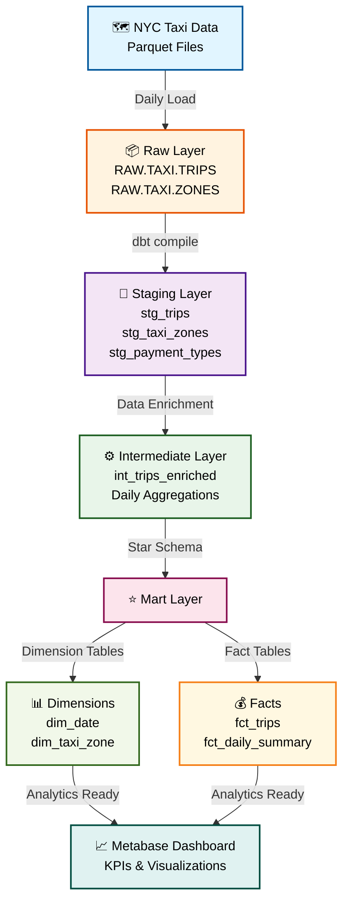

# Data Architecture Diagram

## Architecture Details

### Source Layer
- **NYC Taxi Data** - External Parquet files (daily updates from TLC dataset)

### Raw Layer
- **RAW.TAXI.TRIPS** - 55M+ records, VARIANT column structure
- **RAW.TAXI.ZONES** - 263 lookup records, reference data

### Staging Layer (View)
- `stg_trips` - Standardized trip records with consistent naming
- `stg_taxi_zones` - Cleaned zone reference data
- `stg_payment_types` - Payment type lookup

### Intermediate Layer (Table)
- `int_trips_enriched` - Trips with zone and date lookups pre-joined
- Business logic and enrichment applied
- Single source of truth for trip facts

### Mart Layer (Star Schema)
**Dimensions:**
- `dim_date` - 10+ years of calendar data with fiscal year logic
- `dim_taxi_zone` - 263 zones with surrogate keys

**Facts:**
- `fct_trips` - 55M+ trip transactions with revenue metrics
- `fct_daily_summary` - Daily aggregated metrics by zone and payment type

### Analytics Layer
- **Metabase** - Business intelligence dashboards
- KPIs, trends, geographic analysis
- Real-time query capability

