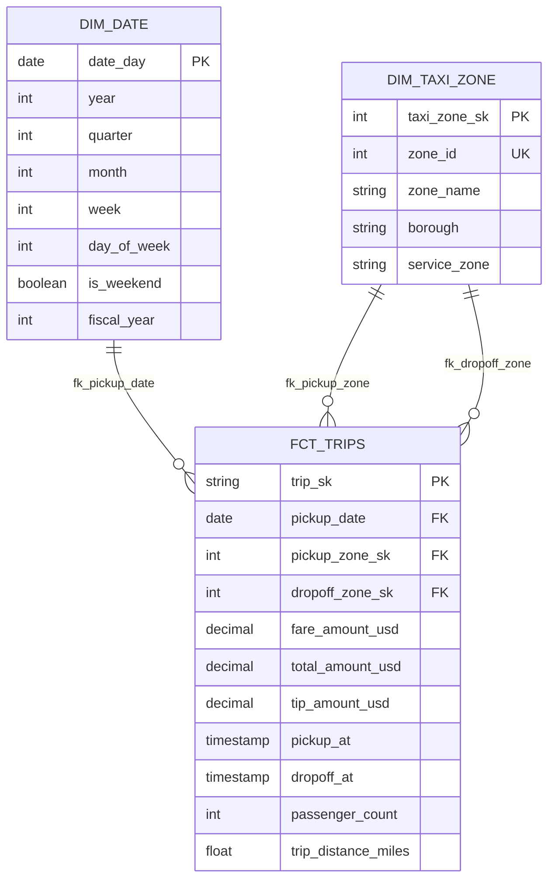

# dbt Analytics Project - Entity Relationship Diagram

## Diagram Description

**Three-Layer Star Schema:**

- **DIM_DATE** (Top) - Temporal dimension providing calendar attributes
- **FCT_TRIPS** (Center) - Fact table capturing taxi trip transactions
- **DIM_TAXI_ZONE** (Bottom) - Location dimension for pickup and dropoff zones

**Key Relationships:**
- One date can have many trips (pickup_date)
- One zone can be many pickup locations
- One zone can be many dropoff locations
- Each trip has exactly one pickup and dropoff zone

